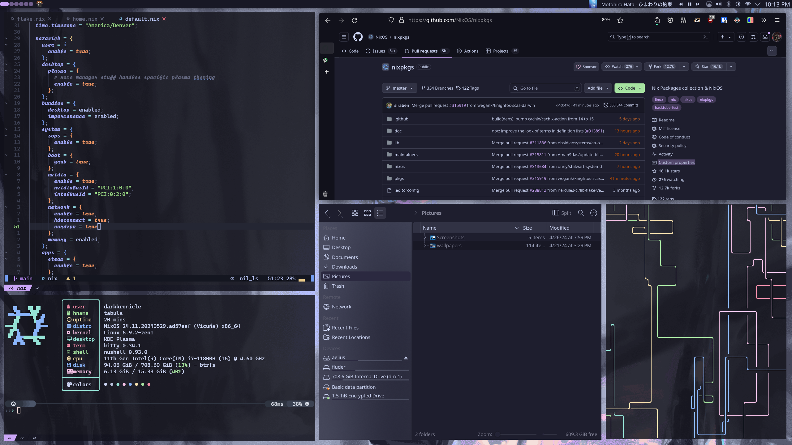

# Nazarick, my NixOS Config

> The world is all yours

> My plasma rice. (The tiling is done manually for this screenshot)

Named after the Great Tomb of Nazarick from Overlord (very good show).

## Structure

After about 3 months of using this config I moved away from [snowfall lib](https://github.com/snowfallorg/lib) (starting commit `ec48787`)
and moved to a fully defined structure following closely [ryan4yin](https://github.com/ryan4yin/nix-config)'s config. This config layout
gives me very fine grained control over my all my systems and variables, and I was able to learn a lot just setting it up. As I add more
systems, I can put them on specific tracks and configurations.

I can highly recommend snowfall lib as you are starting out (or even if you just want to simplify). I mainly moved away so my 
configuration didn't feel as much as a black box, and I wanted fine grained control.

Nix has infected my brain and I've gone a bit insane at declaratively specifying configurations.

This config features most notably:
- Plasma configuration - panels, wallpapers (with applying effects), lockscreen, widgets, etc.
- mpv - plugins, keybinds, shaders, etc.
- Recovery iso has literally everything (including specialisations!)
- Neovim config with lua [here](https://github.com/DarkKronicle/nvim-dotfiles)
- nushell - custom completions (currently WIP)

For some of the more complicated modules I've written a small blog post over at my [garden](https://garden.darkkronicle.com/),
so maybe give that a check. It also has my basic install instructions.

## Credits and Inspiration

I have looked at a *ton* of Nix configs for inspiration and implementations. Here they are (in no particular order):
- [Jake Hamilton](https://github.com/jakehamilton/config) - Original snowfall repo I based mine off. Creator of snowfall.
- [khaneliman](https://github.com/khaneliman/khanelinix) - The second snowfall repo I found. Cool stuff.
- [LuisChDev](https://github.com/nix-community/nur-combined/blob/2c0f9f6f2b853efec50eb90218748c3da55e8df0/repos/LuisChDev/pkgs/nordvpn/default.nix#L88) - Original NordVPN package. Outdated at time of writing.
- [erosanix](https://github.com/emmanuelrosa/erosanix/blob/622114db93eacaff38c4b999b6f674c4134d1277/pkgs/mkwindowsapp/default.nix) - Packaging wine apps within Nix.
- [sioodmy](https://github.com/sioodmy/dotfiles)
- [EmergentMind](https://github.com/EmergentMind/nix-config) - Good YouTube videos. Based my sops on theirs.
- [IogaMaster](https://github.com/IogaMaster/dotfiles)
- [ryan4yin](https://github.com/ryan4yin/nix-config) - A really elegant config
- [librephoenix](https://github.com/librephoenix/nixos-config)
